# Side-Channel Vulnerability in OpenIndiana Hipster 2024.10 due to RST Rate Limiting Leading to TCP Port Number Leakage

During our recent research on network protocol stacks, we discovered a security vulnerability in OpenIndiana Hipster 2024.10. The vulnerability originates from the global rate-limiting mechanism for RST packets in its TCP/IP stack. An attacker can exploit this mechanism to construct a precise side-channel, allowing them to remotely infer the ephemeral port used in a TCP connection between a client and a server. This can be achieved without being on the network path between the two parties, leading to information disclosure.

## 1. Introduction to RST Rate Limiting and Side-Channel Attacks

The TCP RST packet is a crucial signal in the TCP protocol used to forcibly terminate a connection. When a host receives a TCP packet for a port that is not being listened on, its kernel protocol stack responds with an RST packet. To defend against Denial of Service (DoS) attacks and port scanning, OpenIndiana Hipster 2024.10 implements a rate-limiting mechanism for outgoing RST packets. This mechanism sets a global threshold, enabled by default, that caps the number of RST packets that can be sent per second. Once this threshold is exceeded, subsequent RST packets are silently dropped.

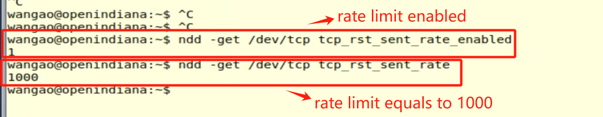

**Figure 1**: RST rate-limiting mechanism in OpenIndiana Hipster 2024.10

This predictable and deterministic rate-limiting behavior creates a side-channel for an **off-path attacker**. The attacker can infer connection information by crafting probe packets and observing whether the target host's rate limit has been triggered, which in turn reveals whether the spoofed packets were "seen" by the target.

## 2. Network Topology for Vulnerability Verification

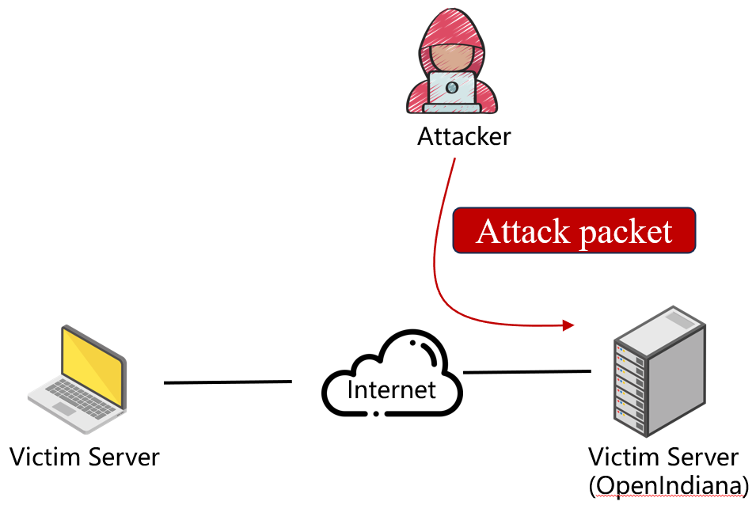

**Figure 2**: Experimental setup for the TCP connection inference in OpenIndiana Hipster 2024.10

- **(1) Server (IP = 192.168.169.131)**: A machine running OpenIndiana Hipster 2024.10. Its IP address (`SERVER_IP`) and the open service port (`SERVER_PORT`) are known to the attacker. 
- **(2) Client (IP = 192.168.169.129)**: The target host. Its IP address (`CLIENT_IP`) is known to the attacker. This host has an established TCP connection with the server. 
- **(3) Attacker (IP = 192.168.169.128)**: A machine located off the communication path between the client and server, but capable of crafting and sending IP packets with a spoofed source address. 

## 3. Vulnerability Exploitation Process

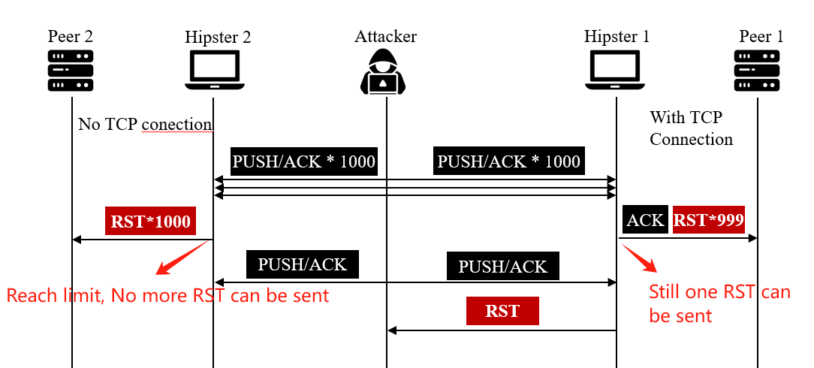

 **Figure 3**: Inferring the TCP connection port number using the RST rate limit (rate = 1000/sec).

**(1) A TCP Connection is Established** First, a standard TCP connection is established between the client and the server. The client uses an ephemeral port, say `1235`, to connect to the server's port `8888`. This port (`1235`) is unknown to the off-path attacker.

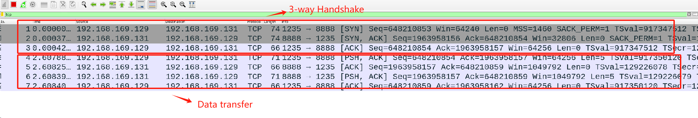

**(2) Attacker Launches the Scanning Process** The attacker runs a Proof-of-Concept (PoC) script on their machine to precisely identify the client's ephemeral port. The attack is based on the core assumption that the client's RST rate limit threshold is **1000 packets per second**.

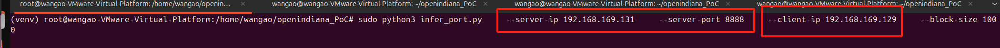

**(3) Coarse-Grained Block Scanning to Narrow the Port Range** As shown in Figure 4, the attacker first divides the client's possible ephemeral port range (e.g., 1024-65535) into multiple "blocks" of 1000. For each block, the attacker spoofs 1000 TCP packets with the **server's IP** as the source address, targeting each of the 1000 ports within that block on the client. The goal is to exhaust the RST rate limit if the real connection's port is within this block.
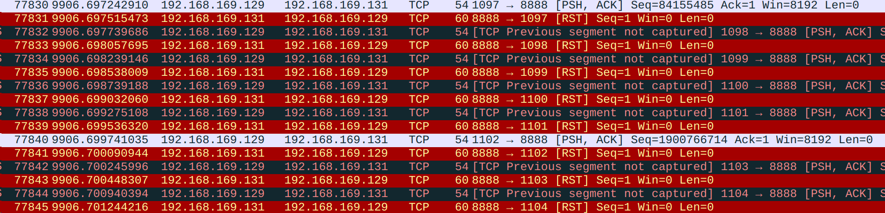

**Figure 4**: Scanning a block of ports (1024-2023).

As shown in Figure 5, the attacker then sends a probe packet from their own IP to a closed port on the client.

- If the RST rate limit was **not** triggered by the preceding 1000 spoofed packets, the client will respond to the attacker's probe with an RST. This indicates the target port is not in the scanned block.

- If the RST rate limit **was** triggered, the client will silently drop the probe packet, and the attacker will receive no RST. This indicates the target port is within the scanned block.

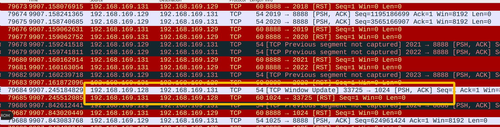

**Figure 5:** The rate limit is not triggered during the scan, and the attacker receives an RST from the probe packet.

**(4) Binary Search for Exact Port**. After identifying the "candidate block" (e.g., 1024-2023), the PoC script proceeds to a more refined binary search phase. The core of this phase is to keep the total number of challenge packets at the rate limit threshold (1000) while varying the ratio of spoofed packets to "padding packets" to extract a signal.

To test the first half of a block (e.g., 1024-1523, a range of 500 ports):

- Send 500 spoofed packets with the server's IP as the source, targeting these 500 ports on the client.
  
  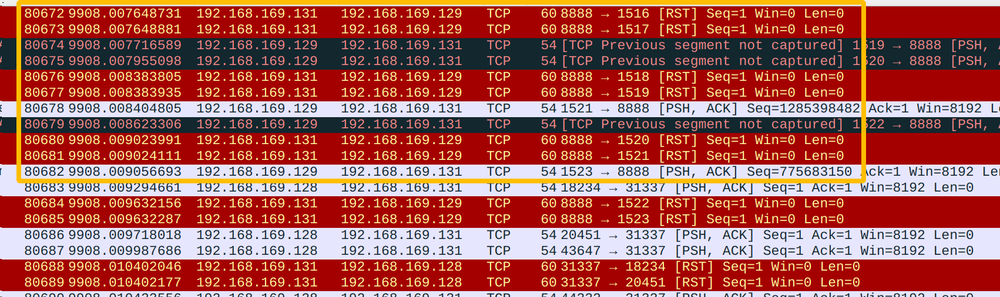

- Send 500 "padding" packets from the attacker's own IP to other irrelevant, closed ports on the client.
  
  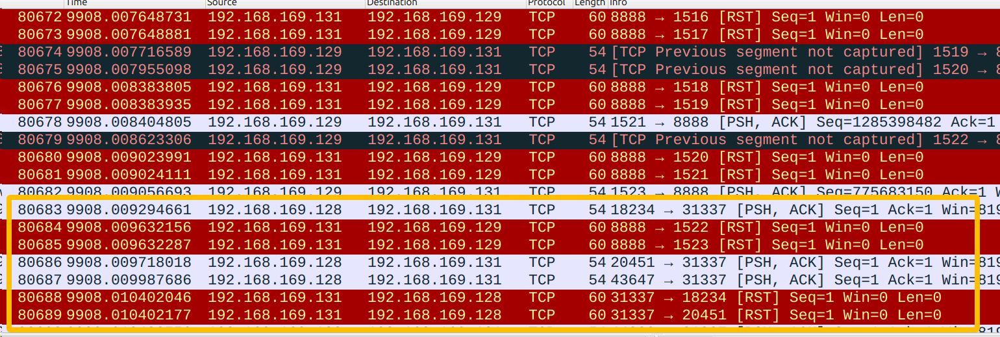

- Send a final probe packet and check for an RST response. We have a RST, so the target port is in 1024-1523
  
  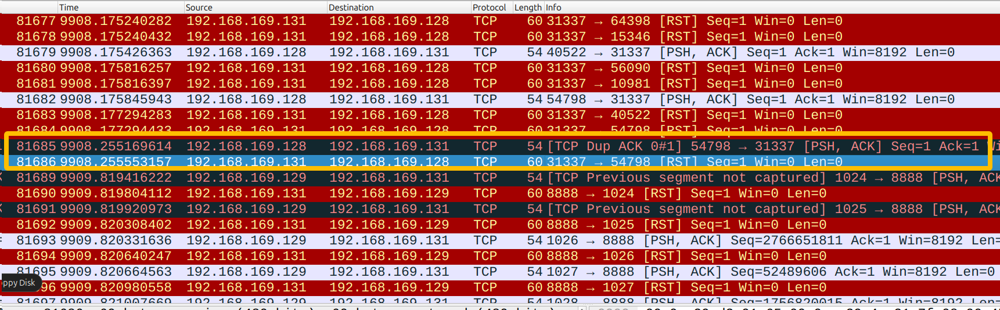

For range with out target port (e.g., 1024-1148, a range of 125 ports), when we send a final probe packet and check for an RST response, no RST will be returned. 

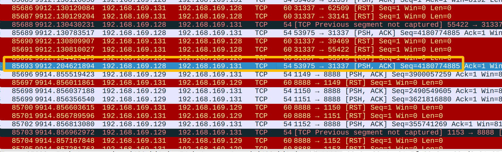

The outcome is again determined by whether the final probe packet receives an RST. This allows the attacker to deduce if the target port is within the tested sub-range, continually halving the search space.

After approximately 10 iterations, the binary search narrows down the port range to a single value. The PoC successfully infers that the client's ephemeral port for the connection is **1235**. At this point, the attacker has successfully obtained the complete 4-tuple information (`CLIENT_IP`, `CLIENT_PORT`, `SERVER_IP`, `SERVER_PORT`) of the TCP connection.

  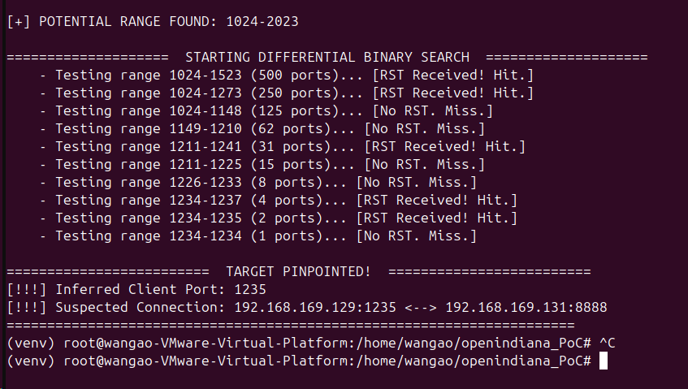
